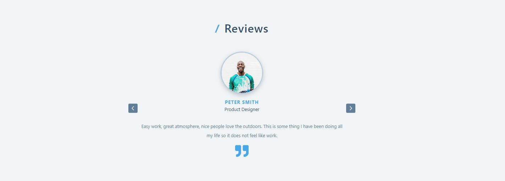

# React reviews slider

  

<!-- ABOUT THE PROJECT -->
## About The Project

React slider functionality using useState and useEffect hooks and setInterval for auto changing slides.

  

    <a href="https://react-slider-reviews.netlify.app/">View Demo Here</a>
  

This project was bootstrapped with [Create React App](https://github.com/facebook/create-react-app).

## Run project

In the project directory, you can run:

### `npm start`

Runs the app in the development mode.\
Open [http://localhost:3000](http://localhost:3000) to view it in your browser.

The page will reload when you make changes.\
You may also see any lint errors in the console.

### `npm install react-icons --save`

Need to install react-icons.

## Built With

[React](https://reactjs.org/) / [JavaScript](https://www.w3schools.com/js/)
 
<!-- USAGE EXAMPLES -->
## Usage

Click on the forward or back button to see the next or previous slide.

Auto slides functionality - if you don't touch any buttons, after 3000 secondes you will be able to see the next slide.

Project Link: https://github.com/kateFrontend/react-reviews-slider